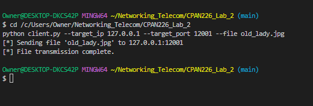
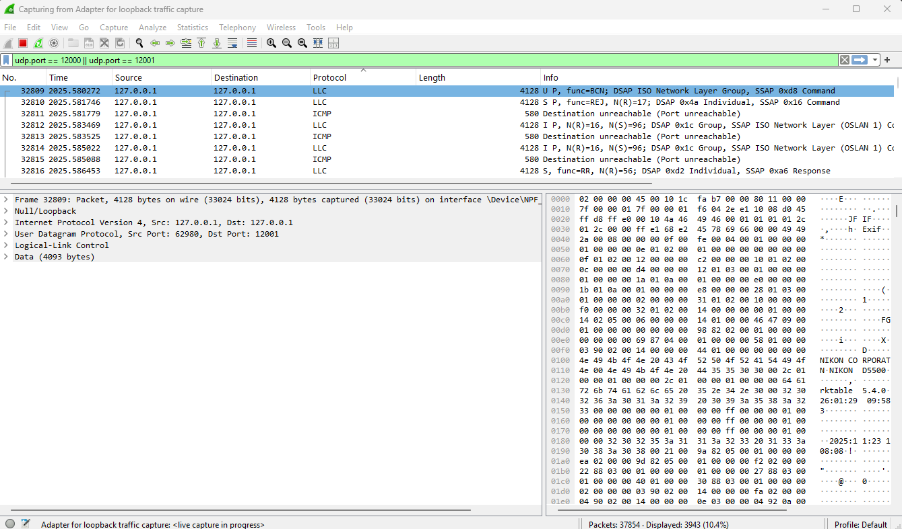
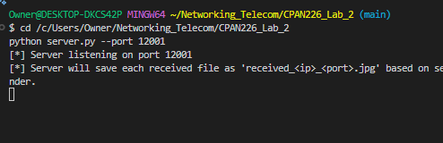
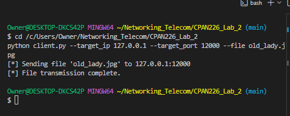
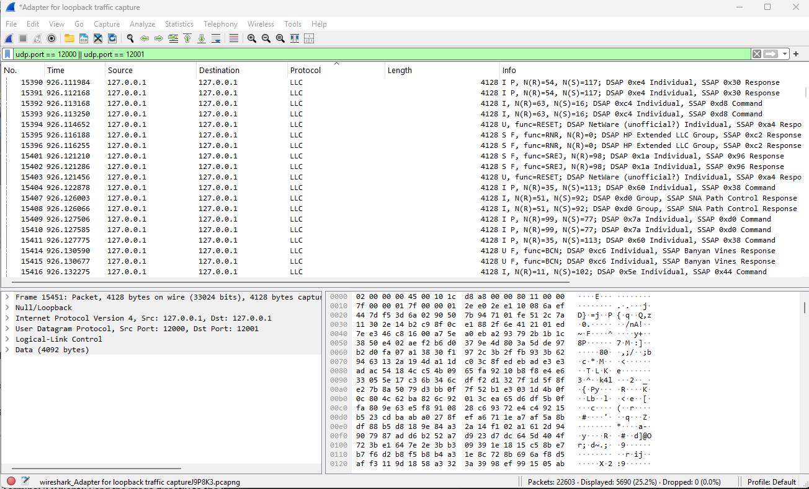
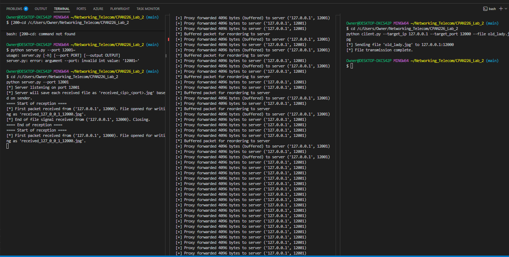
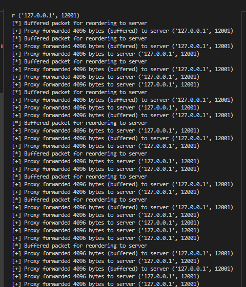

# CPAN226 Lab 2 - UDP Reliability Observations

Lab02 - Harry Joseph - Student Number: N00881767

## Student Info
- Name: Harry Joseph
- Student ID: N00881767

## Assignment Flow
This report follows the Lab 02 observation requirement:
1. Test A (Working network): direct UDP transfer from client to server.
2. Test B (Broken network): UDP transfer through relay with packet reordering.

## Provided/Used Files
- `server.py` - Receiver (modified)
- `client.py` - Sender (modified)
- `relay.py` - Relay simulator (not modified)
- `old_lady.jpg` - test image

---

## Test A - Baseline Test (Direct Connection)

### Objective
Verify starter logic works when there is no relay interference.

### Commands Run
```bash
python server.py --port 12001 --output received_direct.jpg
python client.py --target_port 12001 --file old_lady.jpg
```

### Observation
- Client sends directly to server port `12001`.
- UDP traffic is visible in Wireshark using filter `udp.port == 12000 || udp.port == 12001`.
- Received image is visually correct in baseline transfer.

### Evidence Mapping (Test A)
- `evidence/screenshots/testA_client_send_success.png`  
	Client terminal shows successful file transmission.
  
  
- `evidence/screenshots/testA_wireshark_direct.png`  
	Wireshark shows direct UDP traffic (source/destination loopback, destination port `12001`).
  
  
- `evidence/screenshots/Screenshot 2026-02-18 124601.png`  
	Supporting screenshot for direct test output/result view.
  
  

### Test A Image Files
Original test image:


Latest received image file generated during testing:


---

## Test B - Broken Network (Relay Simulation)

### Objective
Observe behavior when packets are reordered by relay (`20%` reorder, `0%` loss).

### Commands Run
```bash
python server.py --port 12001 --output received_relay.jpg
python relay.py --bind_port 12000 --server_port 12001 --loss 0.0 --reorder 0.2
python client.py --target_port 12000 --file old_lady.jpg
```

### Observation
- Client sends to relay port `12000`, relay forwards to server port `12001`.
- Relay logs show buffered/reordered forwarding events.
- Final received image is corrupted due to out-of-order byte delivery.

### Why Corruption Happens
UDP does not guarantee in-order delivery. With reordering and no sequence/reassembly logic, image bytes are written in the wrong order, causing visual corruption.

### Evidence Mapping (Test B)
- `evidence/screenshots/testB_server_started.png`  
	Server started and listening on port `12001`.
  
  
- `evidence/screenshots/testB_relay_started.png`  
	Relay started with `--loss 0.0 --reorder 0.2`.
  
  
- `evidence/screenshots/testB_client_send_success.png`  
	Client confirms send to relay port `12000`.
  
  
- `evidence/screenshots/testB_server_receive_output.png`  
	Server receive output for relay test.
  
  
- `evidence/screenshots/testB_relay_activity_output.png`  
	Relay output showing buffered/reordered forwarding.
  
  
- `evidence/screenshots/testB_wireshark_relay.png`  
	Wireshark packet evidence for relay path traffic (`12000 -> 12001`).
  
  

---

## Notes
- `relay.py` was not modified.
- In this starter implementation, server output filename behavior uses sender-based naming (`received_<ip>_<port>.jpg`).
- All observations were captured on local loopback traffic in Wireshark.

---

## Date/Time Verification

To satisfy the rubric requirement for visible local date/time evidence:

1. Each required screenshot was captured with the Windows taskbar clock/date visible.
2. Terminal-based timestamp evidence can be recorded using real system time (not simulated).

### Commands for Timestamp Proof Files
```bash
mkdir -p evidence/timestamps
powershell -Command "Get-Date -Format 'yyyy-MM-dd HH:mm:ss zzz'" > evidence/timestamps/testA_time.txt
powershell -Command "Get-Date -Format 'yyyy-MM-dd HH:mm:ss zzz'" > evidence/timestamps/testB_time.txt
```

### Timestamp Evidence Files
- `evidence/timestamps/testA_time.txt`  
	Real local system timestamp for Test A evidence window.
- `evidence/timestamps/testB_time.txt`  
	Real local system timestamp for Test B evidence window.

---

## Submission Screenshot Checklist (Rubric 1-4)

Use these exact filenames for clear grading alignment:

1. `evidence/screenshots/screenshot1_direct_side_by_side.png`  
	Show `old_lady.jpg` and direct-transfer received image side-by-side with visible system date/time.

2. `evidence/screenshots/screenshot2_corrupted_relay.png`  
	Show corrupted relay output image with visible system date/time.

3. `evidence/screenshots/screenshot3_clean_after_fix_via_relay.png`  
	After reliability fix, show clean received image transferred through relay with visible system date/time.

4. `evidence/screenshots/screenshot4_final_check_result.png`  
	Show final check evidence (`--loss 0.3 --reorder 0.2`) and successful clean image result with visible system date/time.

### Final Check Command (Ultimate Test)
```bash
python relay.py --bind_port 12000 --server_port 12001 --loss 0.3 --reorder 0.2
```

### Rubric Screenshot Preview

#### Screenshot 1 - Direct side-by-side
`evidence/screenshots/screenshot1_direct_side_by_side.png`



#### Screenshot 2 - Corrupted relay image (pre-fix behavior evidence)
`evidence/screenshots/screenshot2_corrupted_relay.png`



#### Screenshot 3 - Clean image after fix via relay
`evidence/screenshots/screenshot3_clean_after_fix_via_relay.png`


#### Screenshot 4 - Final check result (`--loss 0.3 --reorder 0.2`)
`evidence/screenshots/screenshot4_final_check_result.png`


